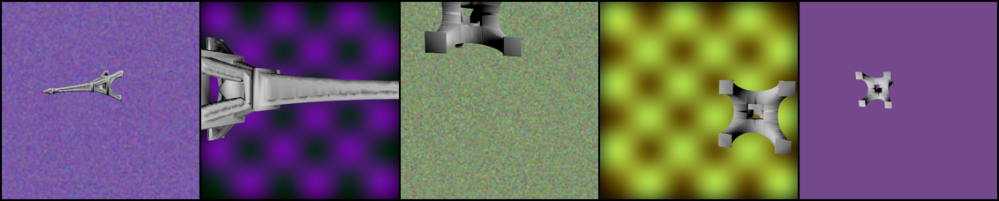
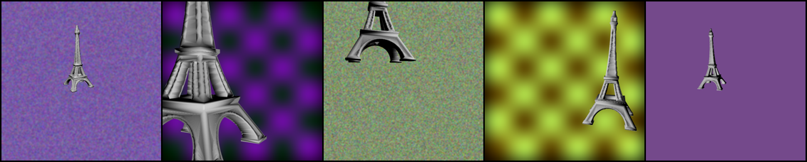

# TextDeformer [[Project Page](https://threedle.github.io/TextDeformer/)]
[](https://arxiv.org/abs/2304.13348)


## Installation

    conda create -y -n TextDeformer python=3.9
    conda activate TextDeformer
    pip3 install torch torchvision --extra-index-url https://download.pytorch.org/whl/cu113
    conda install -y -c conda-forge igl
    pip install -r requirements.txt

## Usage
**NOTE:** This repository **requires** a GPU to run.

### Run examples
``main.py`` is the primary script to use. You may pass arguments using the ``--config`` flag, which takes the path to a ``.yml`` file. See ``example_config.yml`` for an example. Alternatively, you may pass command line arguments manually, which override the arguments provided by the config file. Below, we provide example usage:
    
    # Use all arguments provided by the example config
    python main.py --config example_config.yml

    # Change the optimized mesh to hand.obj, change the base and target text prompts
    python main.py --config example_config.yml --mesh meshes/hand.obj --text_prompt 'an octupus' --base_text_prompt 'a hand'

    # Now, increase the batch size, learning rate, and the training resolution
    python main.py --config example_config.yml --mesh meshes/hand.obj --text_prompt 'an octopus' \
    --base_text_prompt 'a hand' --batch_size 50 --lr 0.005 --train_res 1024

### Outputs
The outputs will be saved to the path specified in the run configuration, which is ``./outputs`` by default. The output folder will contain several folders: ``images`` contains intermittently saved samples of the rendered images passed to CLIP, ``logs`` will contain tensorboard logs of the optimization process, ``mesh_best_clip``, ``mesh_best_total``, and ``mesh_final`` contain the optimized meshes at the best CLIP score, the best total loss, and the final epoch. The configuration file is also saved at ``config.yml`` and a video of the optimization process is saved at ``video_log.mp4``. 

### Common bugs
#### Mesh Orientation
Due to how the camera angles are sampled, the input mesh may need to be re-oriented to ensure proper performance. You can check your mesh orientation by checking ``images/epoch_0.png``. 


*The Eiffel tower mesh is oriented poorly and CLIP will see the mesh rendered from strange viewpoints*



*Here, we re-orient the mesh so that CLIP will see the side profile of the tower*

#### Jacobian temp files
The ``NeuralJacobianFields`` code in this repository will create several temporary files in ``outputs/tmp``. Note that if these temporary files already exist, this code will attempt to read the existing files instead of overwriting them. This may cause issues if you run multiple examples with the same output path, intending to overwrite the output folder.

## Citation
```
@InProceedings{Gao_2023_SIGGRAPH,
    author    = {Gao, William and Aigerman, Noam and Groueix Thibault and Kim, Vladimir and Hanocka, Rana},
    title     = {TextDeformer: Geometry Manipulation using Text Guidance},
    booktitle = {ACM Transactions on Graphics (SIGGRAPH)},
    year      = {2023},
}